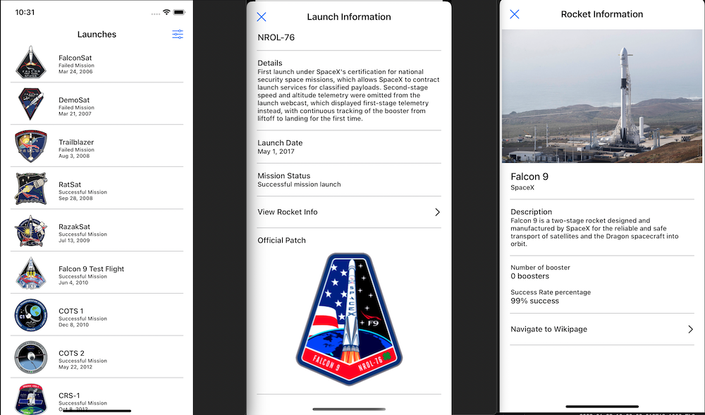

# SpaceX Mission Launch and Rocket Info

This is a simple application displaying the list of SpaceX's mission launches plus some rocket information in each of the launches.

## Architecture / Design Pattern

We went with a modified MVVM (Model View View-Model) architecture to structure our project and give each of the component its own separate concerns. Model's only concern is how it represent the data coming from the server. View's only job is to display the information when needed and ViewModel's job is to mould this information and pass it onto the view by triggering an update (property observers).

We have a ViewModel manager class that takes control of the accesses and flow of data from the backend call, down to triggering the view to display.

## API

We are using the V4 version of this SpaceX [API](https://github.com/r-spacex/SpaceX-API). 

Although the data is not that big, at first I planned to have a pagination querying only 10 data per call then subsequently calling the api again to fetch another 10. But, apparently, this feature has been removed in V4. We need to have our authentication key setup and use when querying if we wanted to have this feature. 

Nevertheless, the fetching and loading of the launch list is relatively quick because of the amount of data being fetch.

## Assumptions
When sorting by date, I have it sorted from latest to earliest as I believe user's would want to checkout what the upcoming missions instead of checking out the past missions.

Getting all mission launches from the API will already return the whole Launch properties that should be feasible to populate Launch Info. I would assume just assigning the viewModel from list to info will eliminate the need to execute another API call. However, since one of the requirement needs to use One Launch, we have to pass the id instead from list to info and execute a fetch on One Launch endpoint to satisfy the requirement.

## Additional Bits
Filtering and sorting is a combined feature so when the user filter mission's status and sort it, it still works. As oppose to having a separate sorting and filtering feature that acts on the list.

Pull down refresh will fetch a fresh set of list and removing the filtered / sorted list if there is any.

## Limitation
Apparently, the grouping of data when sorted (by alphabet and by year) is still on wip. The setup sections and headers is already functional but applying the compositional layout to use the header breaks the UI. Looking to resolve soon but submitting now as discussed with Jack.

## Screenshot

## License
Project is under the MIT License. Please see the [LICENSE](https://github.com/arvinq/TLCspaceX/blob/main/LICENSE) file for more information.

## Attribution
[Space icons](https://www.flaticon.com/free-icons/space) that I used for the app's icon is created by amonrat rungreangfangsai from Flaticon.
